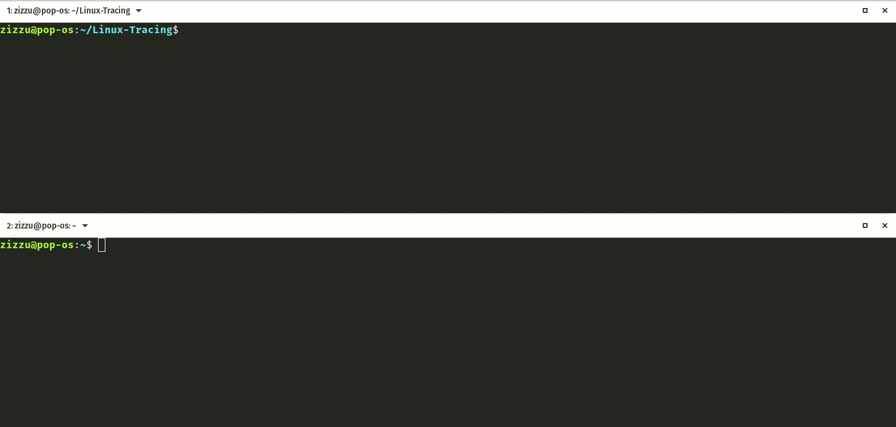

# Linux Tracing tools

### Conversations.py
Get a realtime summary of per pid inet data transmission via BPF Compiler Collection (BCC) https://github.com/iovisor/bcc and associate them with dns responses extracted from libc functions calls.

